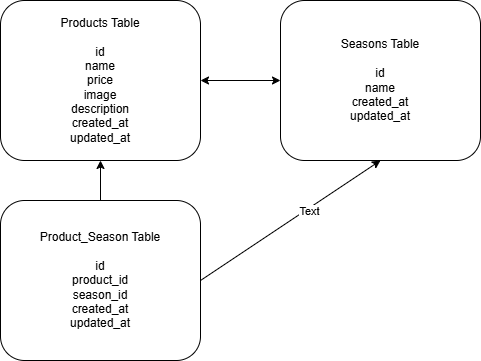

# laravel-docker-template

## アプリケーション名
→#Mogitate

## 環境構築
``bash
git clone git@github.com:maplesama574/mogitate.git
cd mogitate
composer install
cp .env.example .env
php artisan key:generate

``.env
DB_CONNECTION=mysql
DB_HOST=mysql
DB_PORT=3306
DB_DATABASE=laravel_db
DB_USERNAME=laravel_user
DB_PASSWORD=laravel_pass

``bash
docker-compose exec php bash
php artisan migrate
php artisan storage:link
php artisan serve

``bash
docker-compose up -d --build

## 使用技術（実行環境）
Laravel 10
PHP 8.x
MySQL 8.x
Docker 
Bladeテンプレート
CSS

## ER図

## URL
商品一覧 →/products 
商品詳細 →/products/{productId} 
商品更新 →/products/{productId}/update 
商品登録→ /products/register 
検索 →/products/search 
削除 →/products/{productId}/delete 